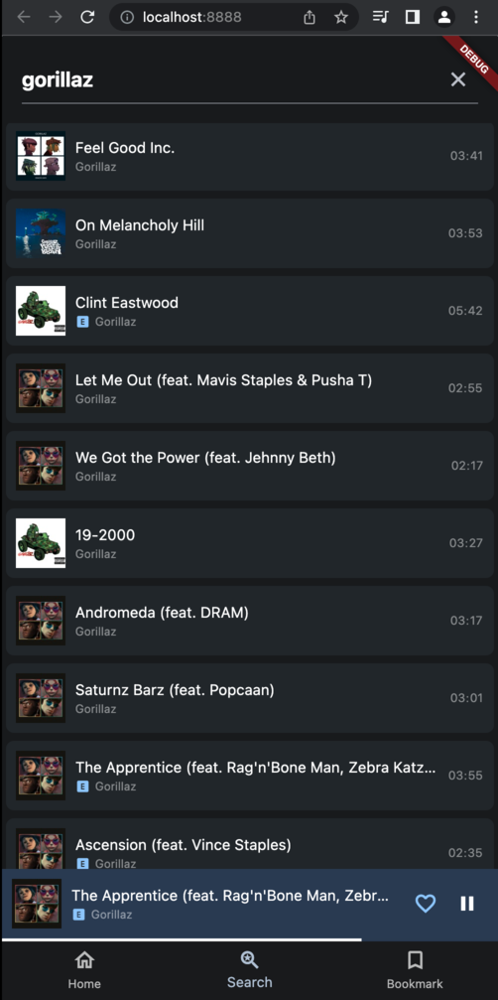
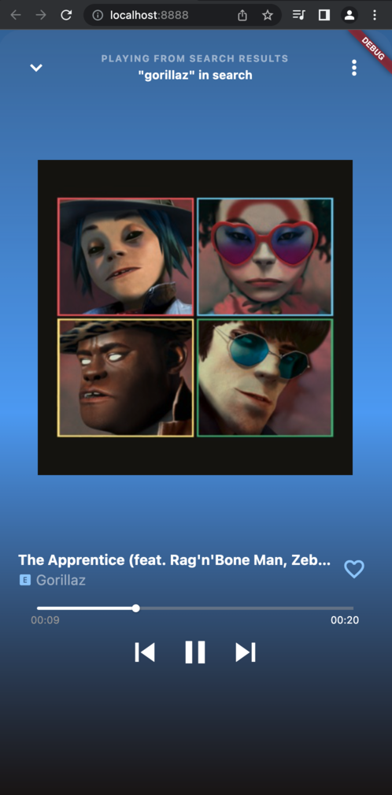
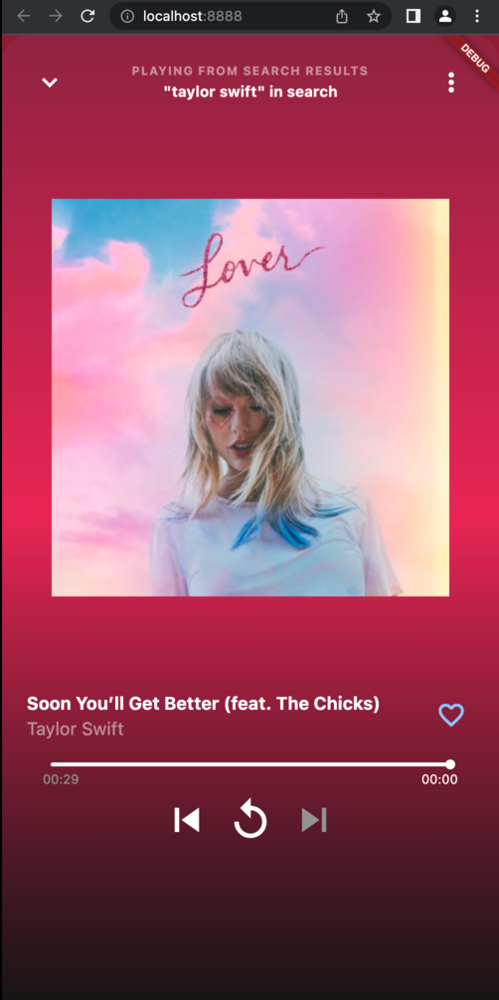
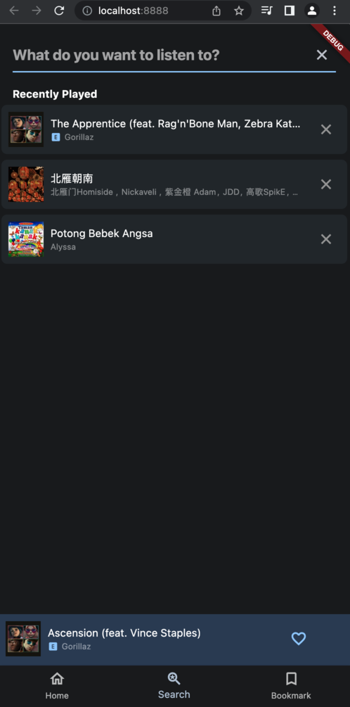

# a3050s

A media player demo app using iTunes search API to preview songs
demo page : https://a3050s.petangpanjang.com

## Features

### Search by term

This demo app only fetch 10 first items by default, and doesn't fetch the next items/pages

### Seek section from song, and skip next or previous from playlist

Jump to the part of the song with seeker bar, and skip to next or previous songs from the playlist

### Recently played

This demo app records 20 songs which have been **tapped/selected** on search results

## Getting Started

1. Install dependencies
2. build/generate the freezed and injectable code with
`flutter pub run build_runner build --delete-conflicting-outputs`
3. generate native splash with `flutter pub run flutter_native_splash:create --path=flutter_native_splash.yml`
4. copy .env.example to new .env file 
   - ENV= *set to prod to disable/hide the debugging features*
   - URL= *itunes api base url*